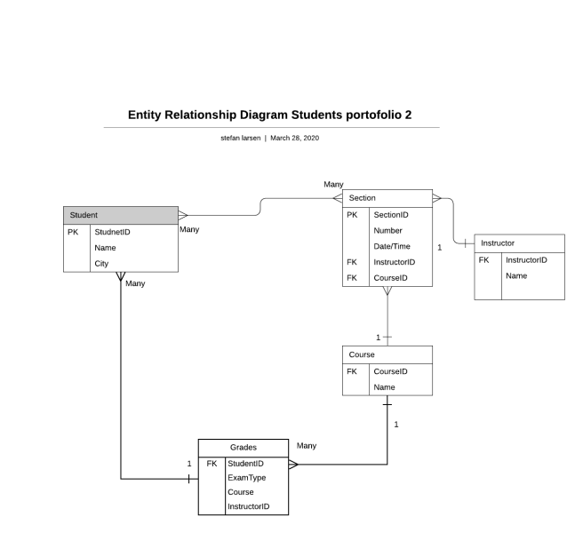
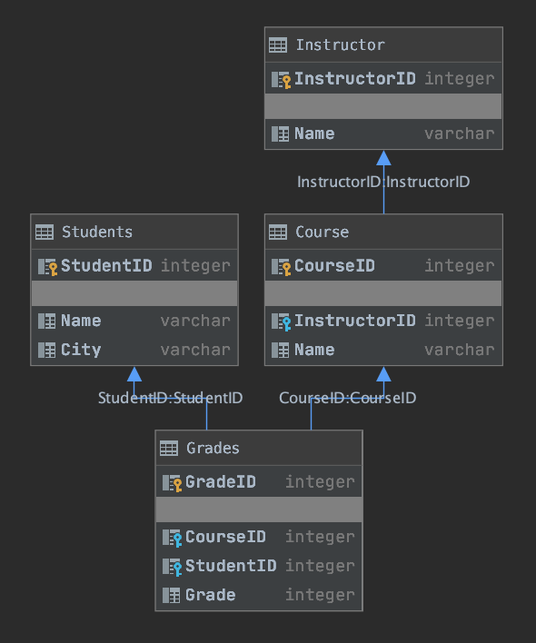

\chapter{Diagrams}
# ER Diagram

For the ER Diagram we have chosen to keep it as logically as possible

* Students have access to – one; grade – many; section
* Section have access to – one; course – one; Instructor
* Course have access to – many; section – many; grades
* Instructor have access to  – many; sections
 
When looking at this ER diagram we in the project group feel that we have created a very readable ER diagram that show the relationships of the entity sets stored in our database. And while looking at the ER diagram the project group also thinks that we have illustrated the logical structure of the database with the simplicity of our diagram.

# Database Generated Diagram

IntelliJ is a handy tool, so we’re able to get it to generate a diagram over our database.
